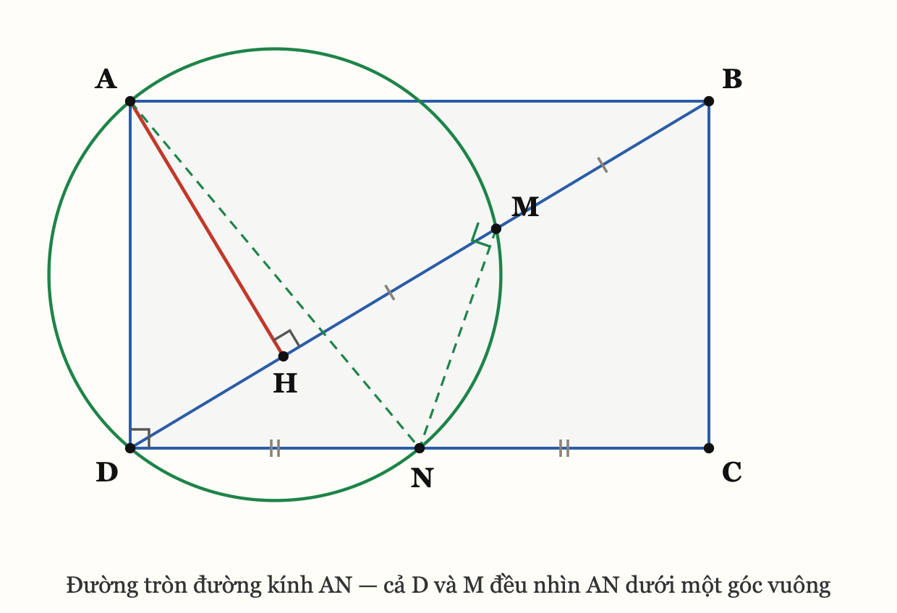
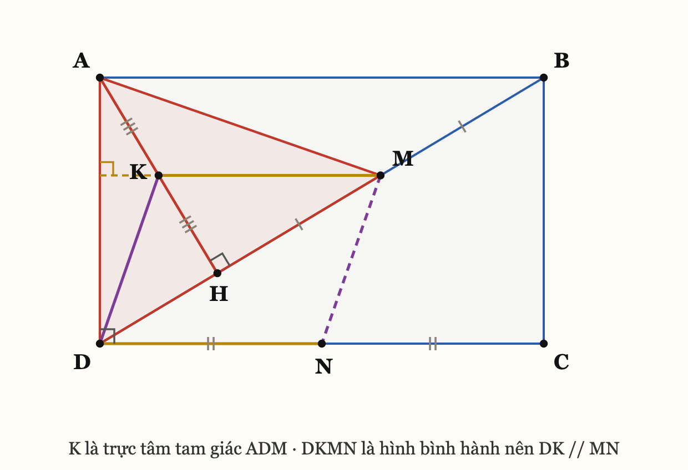
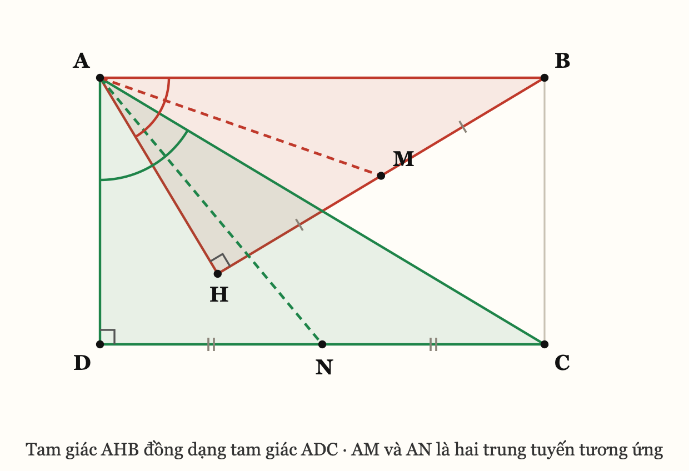
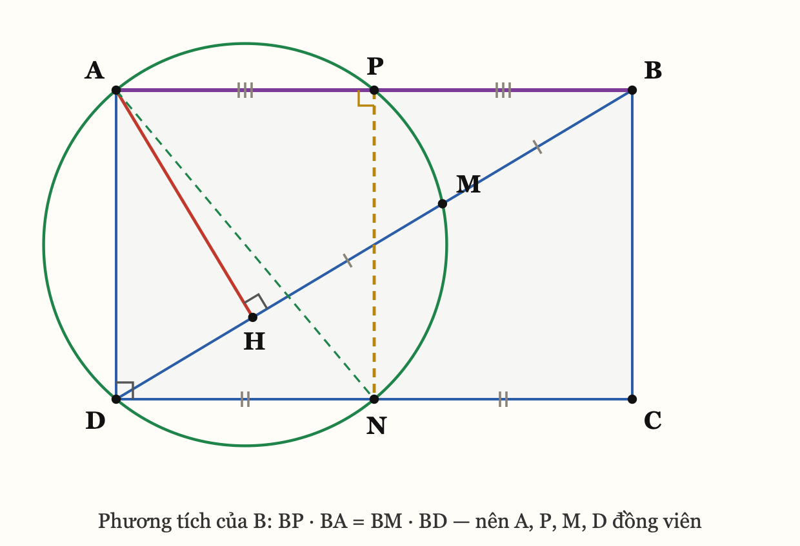

# Bài 10.1 — Đường tròn ngoại tiếp tam giác AMD đi qua trung điểm CD

> Cho hình chữ nhật `ABCD`. Qua `A` kẻ đường thẳng vuông góc với `BD` tại `H`. Gọi `M` là trung
> điểm của `HB`. **Chứng minh rằng đường tròn ngoại tiếp tam giác `AMD` đi qua trung điểm của `CD`.**

Đặt thêm: **`N` là trung điểm của `CD`.** Bài trở thành: chứng minh `A`, `M`, `D`, `N` đồng viên.

---

## Hình

Hình này đã chứa sẵn câu trả lời: đường tròn đi qua `A, M, D, N` nhận **`AN` làm đường kính**.

---

## Cái nhìn đầu tiên

> Trong bốn điểm `A`, `M`, `D`, `N` thì **đã có sẵn một góc vuông: `∠ADN = ∠ADC = 90°`**.
> Một góc vuông nội tiếp thì cạnh đối diện nó **bắt buộc là đường kính**. Vậy đường tròn cần tìm
> chỉ có thể là **đường tròn đường kính `AN`** — không còn lựa chọn nào khác.
> Và khi đó `M` nằm trên nó **khi và chỉ khi `∠AMN = 90°`**.

**Bài từ "chứng minh 4 điểm đồng viên" rút về "chứng minh `AM ⊥ MN`".**

**Vì sao nghĩ tới nó** — đây mới là phần dùng lại được: bài bảo chứng minh đồng viên, mà trong nhóm
điểm đó **đã có một góc vuông cho không**. Góc vuông là dữ kiện đắt nhất trong hình học đường tròn,
vì nó **khoá luôn vị trí của đường tròn**. Đi đường cộng góc là dùng phí nó. Phản xạ:
**đếm góc vuông trước khi chọn dấu hiệu nội tiếp.**

---

## Lời giải (cách nên viết trong bài thi)

**Gọi `N` là trung điểm `CD`, `K` là trung điểm `AH`.**

**(1) `KM` là đường trung bình của tam giác `AHB`.**
`K`, `M` lần lượt là trung điểm của `AH`, `HB`, nên `KM ∥ AB` và `KM = AB/2`.

**(2) `DKMN` là hình bình hành.**
`N` là trung điểm `DC` nên `DN = DC/2 = AB/2` và `DN ∥ AB`. Kết hợp với (1): `KM ∥ DN` và
`KM = DN`. Tứ giác `DKMN` có một cặp cạnh đối song song và bằng nhau nên là hình bình hành, do đó

    DK ∥ MN.                                          (*)

**(3) `K` là trực tâm của tam giác `ADM`.**
Xét tam giác `ADM`:

- `KM ∥ AB` mà `AB ⊥ AD` (giả thiết hình chữ nhật) nên `KM ⊥ AD`
  ⟹ `MK` nằm trên đường cao kẻ từ `M`.
- `H` và `M` cùng thuộc `BD`, mà `AH ⊥ BD`, nên `AH ⊥ DM`; lại có `K ∈ AH`
  ⟹ `AK` nằm trên đường cao kẻ từ `A`.

Hai đường cao cắt nhau tại `K`, vậy `K` là trực tâm tam giác `ADM`, suy ra `DK ⊥ AM`.

**(4) `∠AMN = 90°`.**
Từ (*) `DK ∥ MN` và `DK ⊥ AM`, suy ra `MN ⊥ AM`, tức `∠AMN = 90°`.

**(5) Kết luận.**
`∠ADN = ∠ADC = 90°` và `∠AMN = 90°`, nên `D` và `M` **cùng nhìn đoạn `AN` dưới một góc vuông**.
Vậy `D`, `M` cùng thuộc đường tròn đường kính `AN`, tức bốn điểm `A`, `M`, `D`, `N` cùng thuộc một
đường tròn.

Đường tròn ngoại tiếp tam giác `AMD` chính là đường tròn đường kính `AN`, và nó **đi qua `N` —
trung điểm của `CD`**. ∎

---

## Vì sao nghĩ ra được, kể cả đường cụt

**Đường cụt 1 — thử dấu hiệu "hai góc đối bù nhau" cho `AMND`.** Phải tính `∠AMD`. Nhưng `∠AMD` kề
bù với `∠AMB`, mà `AM` không nối với đoạn nào có sẵn số đo — đề **không cho một góc cụ thể nào**.
Tắc. Bài học: đề không cho góc thì đừng mở đường bằng cộng góc.

**Đường cụt 2 — thử "hai đỉnh kề cùng nhìn một cạnh".** Cũng phải so `∠AMD` với `∠AND`. Tắc vì đúng
lý do trên.

**Cái mở khoá — đếm góc vuông trong hình.** Có sẵn ba góc vuông: tại `A`, tại `D`, tại `H`. Trong
bốn điểm phải chứng minh thì `∠ADN` **đã là góc vuông**. Đó là lúc câu hỏi đổi từ *"dùng dấu hiệu
nội tiếp nào?"* sang ***"đường tròn đó là đường tròn nào?"*** — và câu sau chỉ có một đáp án.

**Vì sao dựng thêm `K`.** Sau khi bài rút về `AM ⊥ MN`, trong hình có **hai trung điểm** `M` và `N`,
nhưng chúng thuộc hai tam giác khác nhau nên chưa ghép được. Muốn `M` có một đường trung bình thì
tam giác chứa nó phải có trung điểm cạnh thứ hai: `M` là trung điểm `HB` của tam giác `AHB`, nên
điểm còn thiếu là **trung điểm `AH`**. Dựng `K` xong thì `KM ∥ AB`, và vì `AB ⊥ AD` nên `KM`
**tự nhiên trở thành một đường cao của tam giác `ADM`** — đó là chỗ trực tâm hiện ra.

---

## Hai cách khác, cho ai muốn đi sâu

Ba cách là **cùng một sự thật nhìn từ ba phía**. Mỗi phía mở ra một lớp bài khác nhau.

### Cách 2 — Đồng dạng xoay

1. Tam giác `ABD` vuông tại `A`, tam giác `DCA` vuông tại `D`, có `AB = DC`, `AD = DA`
   ⟹ `ΔABD = ΔDCA` (c.g.c) ⟹ `∠ABD = ∠DCA`.
2. `ΔAHB` và `ΔADC` có `∠AHB = ∠ADC = 90°` và `∠ABH = ∠ACD` ⟹ **`ΔAHB ~ ΔADC`** (g.g).
3. `M`, `N` là trung điểm `HB`, `DC` — hai cạnh tương ứng — nên `AM`, `AN` là **hai trung tuyến
   tương ứng**. Cụ thể `ΔAHM ~ ΔADN` (c.g.c: `∠AHM = ∠ADN = 90°`, `AH/AD = HM/DN`), do đó
   `∠HAM = ∠DAN` và `AM/AN = AH/AD`.
4. Cộng thêm (hoặc bớt đi) cùng góc `∠HAN` vào hai vế của `∠HAM = ∠DAN`, được `∠MAN = ∠HAD`.
5. `ΔAMN` và `ΔAHD` có `∠MAN = ∠HAD` và `AM/AH = AN/AD` ⟹ **`ΔAMN ~ ΔAHD`** (c.g.c)
   ⟹ `∠AMN = ∠AHD = 90°`. Kết luận như cách 1. ∎

> **Cấu trúc đáng giá:** đây là **đồng dạng xoay (spiral similarity)** ở dạng thuần khiết nhất.
> Từ `ΔAHM ~ ΔADN` (cùng đỉnh `A`) **suy ra ngay** `ΔAHD ~ ΔAMN` — tráo chỗ hai chữ ở giữa.
> Bước 4 là chỗ duy nhất phải cẩn thận cấu hình: tuỳ hình chữ nhật cao hay rộng mà tia `AN` nằm
> trong hay ngoài góc `∠HAD`, nên viết là *"cộng hoặc bớt cùng góc `∠HAN`"* chứ không viết *"cộng"*.

### Cách 3 — Phương tích

**Dựng thêm `P` là trung điểm `AB`.**

1. Tam giác `ABD` vuông tại `A`, `AH` là đường cao ⟹ hệ thức lượng: `AB² = BH · BD`.
2. Do đó `BP · BA = (AB/2) · AB = AB²/2 = (BH/2) · BD = BM · BD`.
3. `P`, `A` cùng nằm trên tia `BA`; `M`, `D` cùng nằm trên tia `BD`. Theo **chiều đảo của phương
   tích**, bốn điểm **`A`, `P`, `M`, `D` đồng viên**.
4. Mặt khác `P`, `N` là trung điểm hai cạnh đối `AB`, `DC` nên `PN ∥ AD`, mà `AD ⊥ AB`, suy ra
   `∠APN = 90°`. Cùng với `∠ADN = 90°`, bốn điểm **`A`, `P`, `N`, `D` đồng viên** (đường tròn
   đường kính `AN`).
5. Hai đường tròn ở (3) và (4) cùng đi qua ba điểm không thẳng hàng `A`, `P`, `D` ⟹ **trùng nhau**.
   Vậy `M` và `N` cùng nằm trên một đường tròn với `A` và `D`. ∎

> **Vì sao `P` phải xuất hiện — phần đáng giữ nhất của bài này:**
> phương tích của một điểm cần **hai cát tuyến qua điểm đó**. Điểm tự nhiên ở đây là `B`: nó nằm
> ngoài đường tròn và đường thẳng `B–M–D` **đã là một cát tuyến cho sẵn**. Cát tuyến thứ hai qua `B`
> chỉ còn một khả năng — đường thẳng `BA`, vì `A` là điểm duy nhất còn lại đã biết nằm trên đường
> tròn. Câu hỏi thu về: ***"`BA` cắt đường tròn lần thứ hai ở đâu?"*** Và hệ thức `AB² = BH · BD`
> trả lời ngay: ở **trung điểm `AB`**.
>
> Đó là cách tìm ra điểm phụ mà không phải đoán. **Điểm phụ không rơi từ trên trời — nó là nghiệm
> của một phương trình phương tích.**

### Kết quả mạnh hơn đề

Gộp cả ba cách lại, sự thật đầy đủ là:

> **Năm điểm `A`, `P`, `M`, `N`, `D` cùng nằm trên đường tròn đường kính `AN`**, trong đó `P`, `N`
> lần lượt là trung điểm hai cạnh đối `AB` và `DC`.

Đề chỉ hỏi bốn điểm trong năm.

---

## Dấu hiệu nhận ra bài tương tự

Viết thành thứ **nhìn thấy được trên hình**, không phải tên chương:

| Thấy gì trên hình | Nghĩ ngay tới |
|---|---|
| Bảo chứng minh 4 điểm đồng viên mà **trong 4 điểm đó đã có sẵn một góc vuông** | Đường tròn **bắt buộc** là đường tròn đường kính của cạnh đối diện góc vuông đó. Bài rút về chứng minh **một góc vuông thứ hai** |
| **Tam giác vuông có đường cao hạ từ đỉnh góc vuông** | `AB² = BH·BD` — **phương tích đang nằm sẵn trong hình**, chỉ chờ được gọi tên |
| **Hai trung điểm** của hai đoạn thẳng | Đường trung bình. Nếu hai trung điểm ở hai tam giác khác nhau thì **dựng thêm trung điểm thứ ba** để ghép |
| Một đường trung bình **vuông góc với một cạnh** của tam giác đang xét | **Trực tâm** — đường trung bình đó là một đường cao trá hình |
| Hai tam giác đồng dạng, đề lấy **trung điểm hai cạnh tương ứng** | **Đồng dạng xoay**: `ΔAXY ~ ΔAZT` ⟹ `ΔAXZ ~ ΔAYT`. Tráo hai chữ ở giữa |
| Một điểm nằm ngoài đường tròn và **đã có một cát tuyến qua nó** | Tìm **cát tuyến thứ hai** — thường là đường nối điểm đó với một đỉnh đã biết, và giao điểm thứ hai chính là điểm phụ cần dựng |

---

## Checklist kiến thức (tự chấm: gật thì bỏ qua, lắc thì xuống phần dưới)

- ☐ **Góc nội tiếp chắn nửa đường tròn bằng `90°`**, và chiều đảo: `∠AXB = 90°` thì `X` thuộc đường
  tròn đường kính `AB`.
- ☐ **Quỹ tích:** hai điểm cùng nhìn một đoạn thẳng dưới góc `90°` thì cùng thuộc đường tròn đường
  kính đoạn đó.
- ☐ **Đường trung bình** của tam giác: song song và bằng nửa cạnh thứ ba.
- ☐ **Dấu hiệu hình bình hành:** một cặp cạnh đối song song **và** bằng nhau.
- ☐ **Trực tâm:** ba đường cao đồng quy — và cách dùng nó *ngược*: chỉ ra hai đường cao cắt nhau ở
  đâu thì đường thứ ba tự vuông góc.
- ☐ **Hệ thức lượng trong tam giác vuông:** `AB² = BH·BC` với `AH` là đường cao, `H ∈ BC`.
- ☐ **Phương tích, chiều đảo:** `BP·BA = BM·BD` với `P, A` trên một tia và `M, D` trên tia kia thì
  `A, P, M, D` đồng viên.
- ☐ **Tam giác đồng dạng:** tỉ số hai trung tuyến tương ứng bằng tỉ số đồng dạng.
- ☐ **Đồng dạng xoay:** `ΔAXY ~ ΔAZT` ⟹ `ΔAXZ ~ ΔAYT`.

---

## Nếu hổng thì lùi lại — bốn bài dễ hơn

Không giảng lại lý thuyết. Mỗi chỗ hổng có **một bài mẫu giải sẵn** và **một bài tự làm**.

### Hổng A — "góc vuông ⟹ đường tròn đường kính"

**Bài mẫu A.** Cho tam giác `ABC` có hai đường cao `BE` và `CF` (`E ∈ AC`, `F ∈ AB`). Chứng minh
`B`, `C`, `E`, `F` cùng thuộc một đường tròn và chỉ ra tâm của nó.

> *Giải.* `BE ⊥ AC` nên `∠BEC = 90°`. `CF ⊥ AB` nên `∠BFC = 90°`. Vậy `E` và `F` **cùng nhìn đoạn
> `BC` dưới một góc vuông**, nên `E`, `F` cùng thuộc đường tròn đường kính `BC`. Bốn điểm `B`, `C`,
> `E`, `F` đồng viên; **tâm là trung điểm của `BC`**. ∎
>
> Đây đúng là bước (5) của bài 10.1, chỉ khác cái tên.

**Bài A′ — tự làm.** Cho tam giác `ABC`, hai đường cao `AD` và `BE` cắt nhau tại `H`. Chứng minh tứ
giác `CDHE` nội tiếp, và **chỉ rõ đường kính** của đường tròn đó.

### Hổng B — hệ thức lượng và chiều đảo của phương tích

**Bài mẫu B.** Cho tam giác `ABC` vuông tại `A`, đường cao `AH` (`H ∈ BC`). Gọi `M` là trung điểm
`HB`, `P` là trung điểm `AB`. Chứng minh `BM · BC = BP · BA`.

> *Giải.* Tam giác `ABC` vuông tại `A`, `AH` là đường cao ⟹ `AB² = BH · BC`.
> Do đó `BM · BC = (BH/2) · BC = AB²/2 = AB · (AB/2) = BA · BP`. ∎

**Bài B′ — tự làm.** Vẫn giả thiết bài mẫu B: chứng minh bốn điểm `A`, `P`, `M`, `C` cùng thuộc một
đường tròn.

> Làm xong A′ và B′ là **đã tự dựng lại được cách 3 của bài 10.1**, chỉ còn thiếu đúng một bước
> ghép hai đường tròn. Đó là chủ ý của cặp bài này.

<b>Đáp án gợi ý — chỉ mở sau khi đã tự làm</b>

**A′.** `AD ⊥ BC` nên `∠HDC = 90°`; `BE ⊥ AC` nên `∠HEC = 90°`. Hai điểm `D`, `E` cùng nhìn đoạn
`HC` dưới góc vuông ⟹ `D`, `E` thuộc đường tròn đường kính `HC`. Vậy `CDHE` nội tiếp đường tròn
**đường kính `HC`**.
*(Cách khác: `∠HDC + ∠HEC = 180°` — hai góc đối bù nhau. Cùng một sự thật.)*

**B′.** Theo bài mẫu B: `BP · BA = BM · BC`. Mà `P`, `A` cùng nằm trên tia `BA` và `M`, `C` cùng
nằm trên tia `BC`. Theo chiều đảo của phương tích, bốn điểm `A`, `P`, `M`, `C` đồng viên. ∎

---

*Mọi khẳng định trong bài đã được kiểm chứng bằng số trên 5000 hình chữ nhật ngẫu nhiên — 0 phản ví
dụ. Hình vẽ sinh bằng SVG rồi render ra PNG.*
